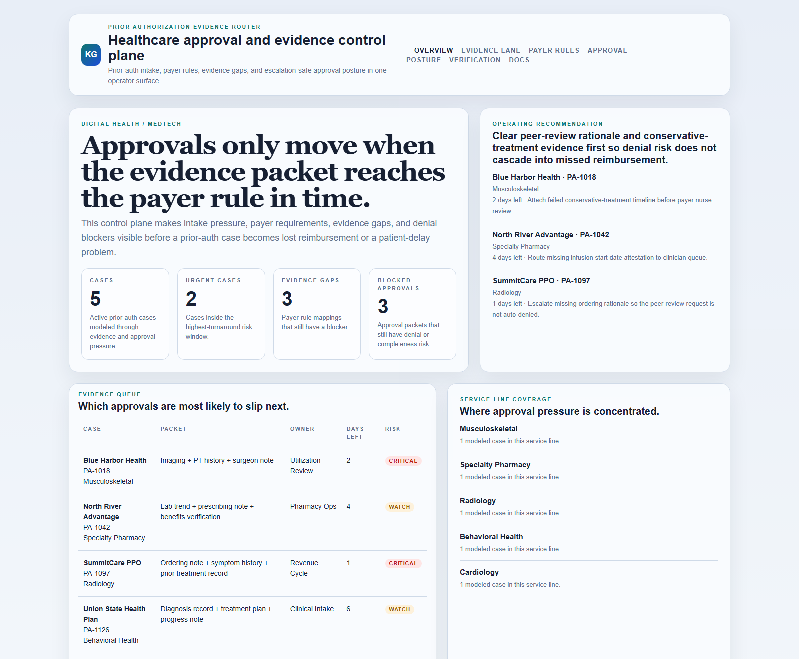
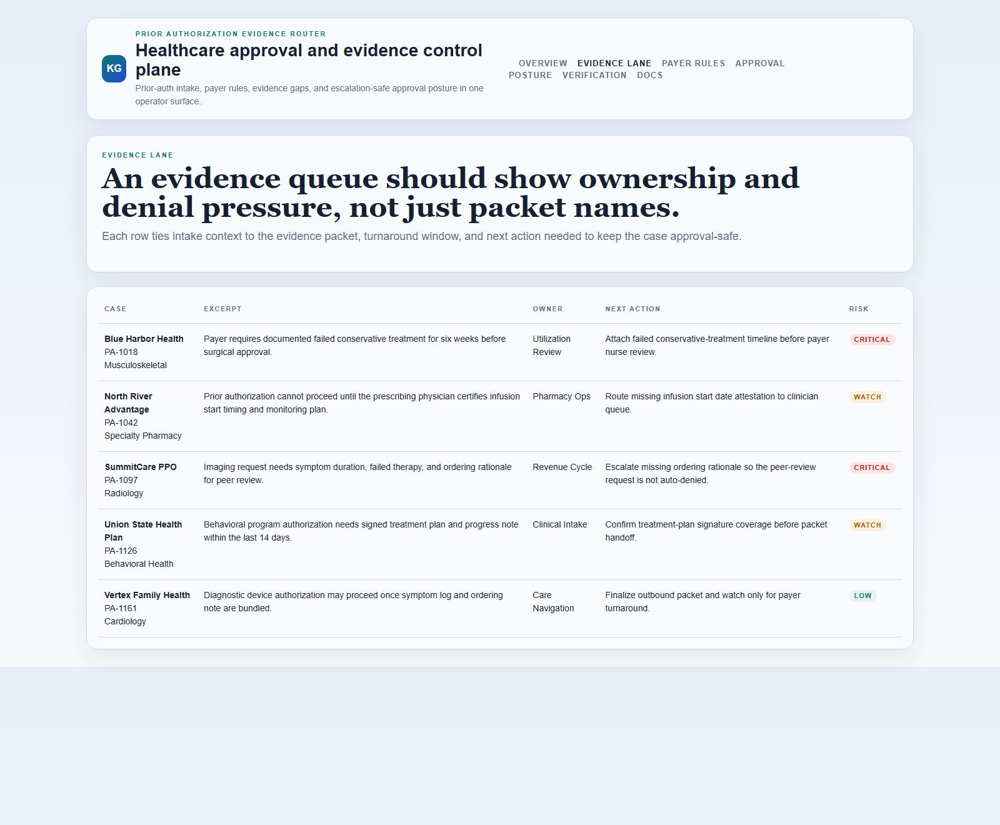
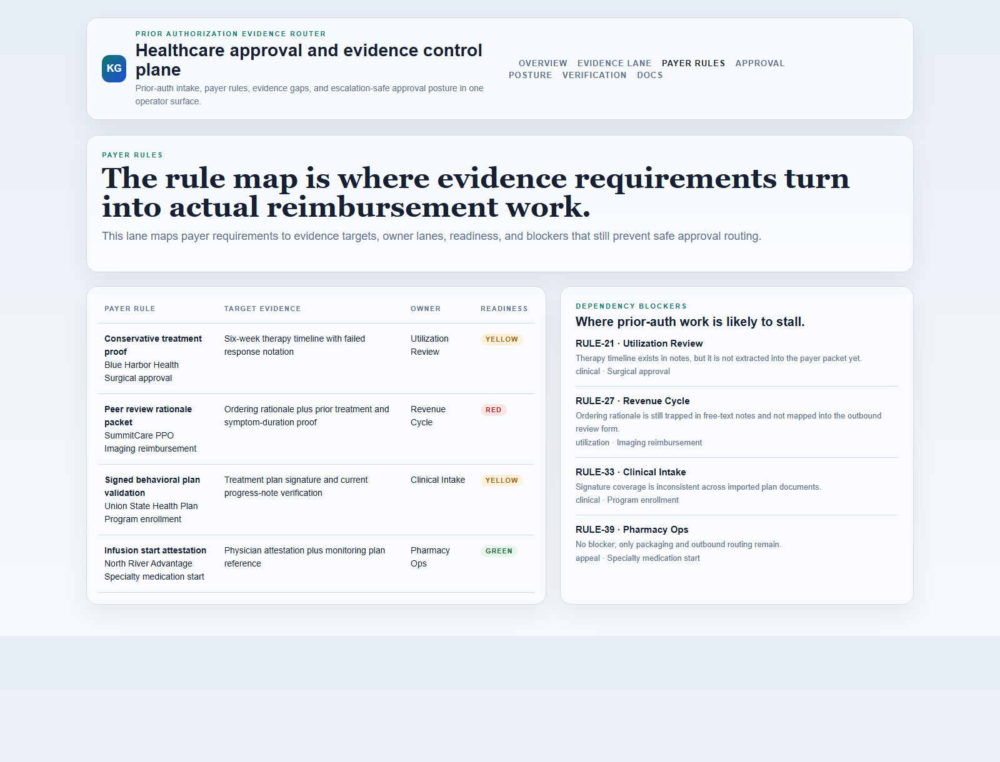
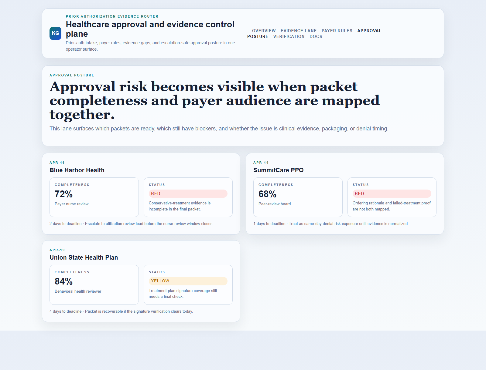

# Prior Authorization Evidence Router

[](https://github.com/mizcausevic-dev/prior-authorization-evidence-router/actions/workflows/ci.yml)
[](./LICENSE)
[](./.github/dependabot.yml)
[](https://github.com/mizcausevic-dev/prior-authorization-evidence-router/actions/workflows/pages.yml)

TypeScript control plane for prior-authorization intake, evidence routing, payer-rule pressure, and approval-safe escalation across healthcare workflows.

## Why this exists

- Prior-auth teams lose time when clinical evidence, payer requirements, and owner handoffs live in separate systems.
- Denials often come from routing failures and incomplete packets, not from a lack of patient or procedure context.
- Revenue cycle, utilization review, and clinical operations all need the same approval picture without waiting on another spreadsheet.
- Digital health buyers care whether the approval workflow is auditable and recoverable, not whether the dashboard looks "AI-powered."

## Why this matters (KG Embedded tie-back)

This repo demonstrates the evidence-routing primitive for Digital Health / MedTech buyers: intake cases tied to payer rules, evidence gaps, approval blockers, and owner-safe escalation paths. A B2B SaaS buyer would care because healthcare approvals and denials often need to surface inside customer-facing operator tools without exposing PHI-heavy systems or unsafe write paths. Kinetic Gain Embedded extends this into security-first in-product analytics for approval-aware and evidence-aware reporting across care delivery and revenue operations, see [kineticgain.com/embedded](https://kineticgain.com/embedded).

## Routes

- `/`
- `/evidence-lane`
- `/payer-rules`
- `/approval-posture`
- `/verification`
- `/docs`

## API

- `/api/dashboard/summary`
- `/api/evidence-lane`
- `/api/payer-rules`
- `/api/approval-posture`
- `/api/verification`
- `/api/sample`

## Screenshots






## Local Development

```powershell
cd prior-authorization-evidence-router
npm install
npm run dev
```

Open:
- [http://127.0.0.1:5438/](http://127.0.0.1:5438/)
- [http://127.0.0.1:5438/evidence-lane](http://127.0.0.1:5438/evidence-lane)
- [http://127.0.0.1:5438/payer-rules](http://127.0.0.1:5438/payer-rules)
- [http://127.0.0.1:5438/approval-posture](http://127.0.0.1:5438/approval-posture)
- [http://127.0.0.1:5438/verification](http://127.0.0.1:5438/verification)

## Validation

- `npm run build`
- `npm run test`
- `npm run demo`
- `npm run smoke`
- `npm run render:assets`

## Production status

<!-- Maintained by Claude Code (Platform/SRE lane) after v1.0-prod hardening. -->

| Aspect | Status |
|--------|--------|
| CI | Node 20 + 22 matrix — lint · typecheck · coverage · build · demo · smoke · `npm audit` ([workflow](./.github/workflows/ci.yml)) |
| Test coverage | 100% statements on `src/services/` (gate: ≥ 60%); synthetic, non-PHI fixtures only |
| License | [AGPL-3.0-or-later](./LICENSE) |
| Dependencies | Dependabot weekly (npm + GitHub Actions); `npm audit --audit-level=high` in CI |
| Compliance | **HIPAA-readiness scaffolding only — not HIPAA/SOC 2/BAA compliant.** See [SECURITY.md](./SECURITY.md). Do not deploy with real PHI. |
| Deploy | Static prerender → **https://priorauth.kineticgain.com/** (GitHub Pages, [pages workflow](./.github/workflows/pages.yml)) |

## Docs

- [Architecture](./docs/architecture.md)
- [Origin](./docs/ORIGIN.md)
- [Kinetic Gain Embedded tie-back](./docs/KINETIC_GAIN_EMBEDDED.md)
- [Changelog](./CHANGELOG.md)

## Part of the Kinetic Gain Suite

Operator surface in the [Kinetic Gain Suite](https://suite.kineticgain.com/) — a portfolio of buyer-readable control planes spanning security posture, compliance evidence, data-platform governance, FinOps, and operator workflows. See the suite index for related surfaces. Apex: [kineticgain.com](https://kineticgain.com/).
